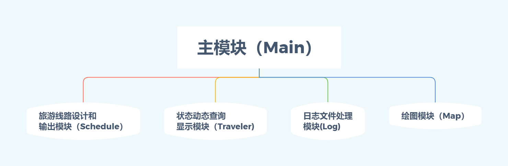

# 目录
---
1. 设计任务描述
2. 功能需求说明及分析
3. 总体方案设计说明
   - 3.1 软件开发环境
   - 3.2 总体结构与模块划分
      - 3.2.1 主模块（Main）
      - 3.2.2 旅游线路设计和输出模块（Schedule）
      - 3.2.3 状态动态查询显示模块（Traveler)
      - 3.2.4 日志文件处理模块(Log)
      - 3.2.5 绘图模块（Map）

# 1. 设计任务描述
---
&emsp;&emsp;城市之间有三种交通工具（汽车、火车和飞机）相连，某旅客于某一时刻向系统提出旅行要求，系统根据该旅客的要求，实现以下功能：

- 为旅客设计一条旅行线路并输出；
- 查询当前时刻旅客所处的地点和状态（停留城市/所在交通工具）。
    

# 2. 功能需求说明及分析
---
- 城市总数不少于10个
- 查询系统应建立汽车、火车和飞机的时刻表（航班表）   
   - 有沿途到站及票价信息
   - 班次不能太简单（不能总只是1班车次相连）
- 旅客的要求包括：起点、终点、途经某些城市和旅行策略
- 旅行策略有：   
   - 最少费用策略：无时间限制，费用最少即可   
   - 最少时间策略：无费用限制，时间最少即可   
   - 限时最少费用策略：在规定的时间内所需费用最省
- 旅行模拟查询系统以时间为轴向前推移，每10秒左右向前推进1个小时(查询状态的请求不计时)
- 不考虑城市内换乘交通工具所需时间
- 系统时间精确到小时
- 建立日志文件，对旅客状态变化和键入等信息进行记录
- 某旅客在旅行途中可更改旅行计划，系统应做相应的操作
- 用图形绘制地图，并在地图上反映出旅客的旅行过程
    

# 3. 总体方案设计说明
---
## 3.1 软件开发环境
- IDE：Visual Studio 2017
- 编译器：MinGW
- 系统：Windows, Mac
   

## 3.2 总体结构与模块划分

  

|序号|模块名称|模块标识|
|:---:|:---:|:---:|
|1|主模块|Main|
|2|旅游线路设计和输出模块|Schedule|
|3|状态动态查询显示模块|Traveler|
|4|日志文件处理模块|Log|
|5|绘图模块|Map|
  

### 3.2.1 主模块（Main）   
   - 在图形界面，接收用户的键盘键入命令
   - 分析该命令并调用相应的模块
   - 以时间为轴向前推进 
   - 在图形界面，输出并储存旅客信息   
    

### 3.2.2 旅游线路设计和输出模块（Schedule）   
   - 根据旅客的初始行程要求，计算最优旅行规划
   - 在目前已走行程的基础上，根据旅客的变更行程要求，重新计算最优旅行规划
   - 输出相应的最优旅游线路   
  

### 3.2.3 状态动态查询显示模块（Traveler)   
   - 查询并显示当前时刻旅客所处的地点和状态（停留城市/所在交通工具）
   - 输入城市名称，输出到达和离开该城市的日期及时间   
  

### 3.2.4 日志文件处理模块(Log)   
   - 建立日志文件，对旅客状态变化和键入等信息进行记录
   - 根据查询日志文件的要求，以文本方式输出到log.txt   
  

### 3.2.5 绘图模块（Map）   
   - 根据最优旅行规划，计算旅客各个时间状态下的坐标
   - 用图形绘制地图
   - 输出地图上旅客的旅行过程

   
