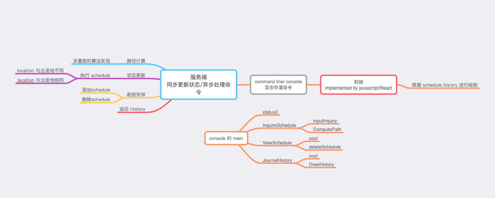

# 极其简化版的函数\模块说明



# 控制台

主要功能：异步向服务端提出请求。

1. 控制台main函数的定义（command line）

```cpp
// time_t now = time(0); // 当前时间的全局变量
time_t TIME(); // 能变速的时间变量


// 异步
int main(){
    while(1){
        if(login()){
            while(login){
                cout << status();
                cin >> input; // 输入选项进入相应的程序。
                swith input:
                case 0:InquireSchedule();break;
                case 1:ViewSchedule();break;
                case 2:JournalHistory();break;
                case 3:logout();break;   
            }
        }
    }
    return 0;
}
```

1. InquireSchedule();
```cpp
void InquireSchedule();{
    while(1){
        json inquiry = inputInquiry();
        json answer = ComputePath(inquiry);

        cout << answer;

        cin >> flag;
        if(flag){
            std::ofstream o("pretty.json");
            o << std::setw(4) << j << std::endl;
        }else{
            return;
        }
    }
}
```

2. ViewSchedule();
```cpp
void ViewSchedule(){
    std::ifstream i("ScheduleList.json");
    json j;
    i >> j;

    // vector<json> ScheduleList = read("ScheduleList.json")
    // for(vector<json>::iterator iter = ScheduleList.begin();iter!=ScheduleList.end();iter++){
    //     cout << (*iter) <<endl;
    // }

    // 需要删除行程吗？如果需要请选择序号
    cin >> flag;
    if(flag){
        deleteSchedule(flag);
    }
}
```

3. JournalHistory();
```cpp
void JournalHistory(){
    // vector<json> JournalHistory = read("JournalHistory.json")
    std::ifstream i("JournalHistory.json");
    json JournalHistory;
    i >> JournalHistory;

    cout << JournalHistory;

    cin >> flag;
    if(flag){
        DrawHistory(JournalHistory);
    }

    return;
}
```

# 服务端

主要功能：
同步地更新所有用户的状态（位置），航班安排。异步接受同步端的请求。
1. 路径计算
2. 状态更新
3. 航班增添/ 修改

以下内容仅做参考。
由于我个人还不会 c++下的网络编程库，服务端函数的介绍用python代替。
```python
import socket
import threading
import time

def tcplink(sock,addr):
	print('Accept new conncetion from%s:%s...' % addr)
	sock.send(b'Welcome!')
	while True:
		data = sock.recv(1024)
		time.sleep(1)
		if not data or data.decode('utf-8') == 'exit':
			break
		sock.send(('你好~, %s!' % data.decode('utf-8')).encode('utf-8'))
	sock.close()
	print('Connection from %s:%s closed.' % addr)

if __name__ == "__main__":
	s = socket.socket(socket.AF_INET, socket.SOCK_STREAM)
	s.bind(('127.0.0.1',6969))
	s.listen(5)
	print("Waiting for connection...")

	while True:
		sock, addr = s.accept()
		t = threading.Thread(target=tcplink, args=(sock,addr))
		t.start()
```

客户端代码举例。实际上我们的客户端就是开篇所述的控制台。
```dart
import 'dart:io';
import 'dart:convert';

main() async {
  //连接服务器的4041端口
  var socket = await Socket.connect(InternetAddress.LOOPBACK_IP_V4, 6969);

  print("向Server发送数据:Server 你好吖！！");
  socket.add(utf8.encode('你好吖！！'));
  socket.transform(utf8.decoder).listen((data) {
    print("接收到来自Server的数据：" + data);
  });
  socket.close();
}
```

# 可视化界面
主要功能：
套一层 javascript 的壳，同时实现 drawhistory的功能。
```js
// 居然是0耶
```